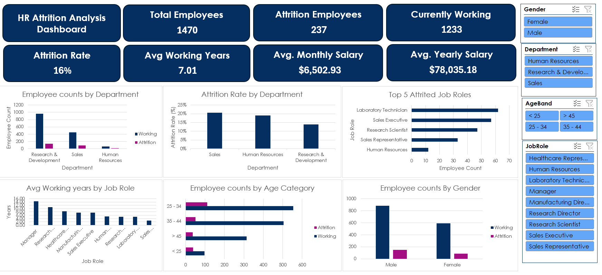
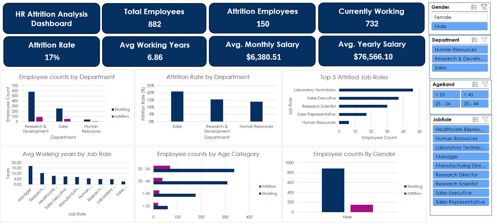
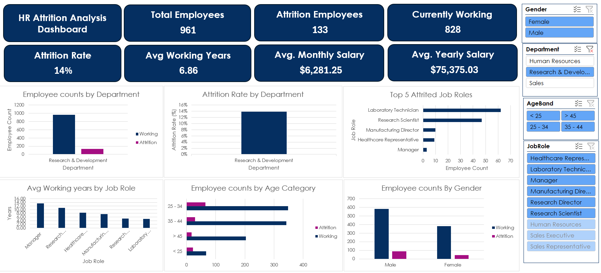
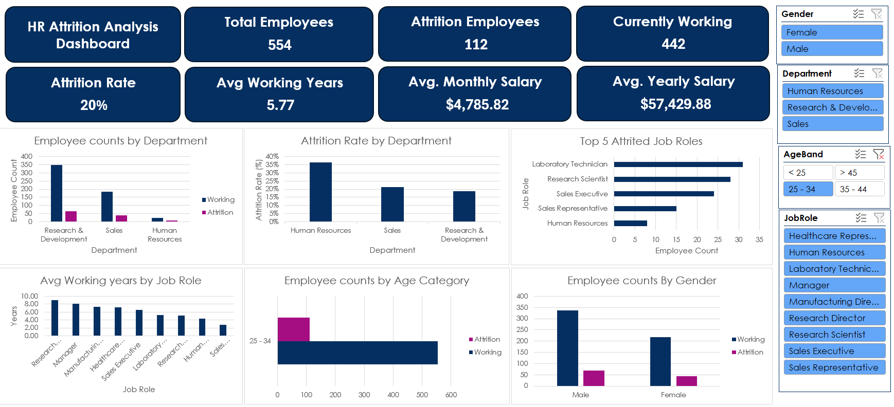
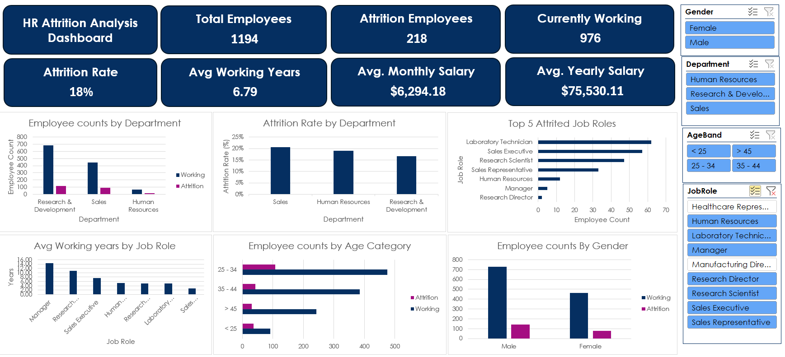
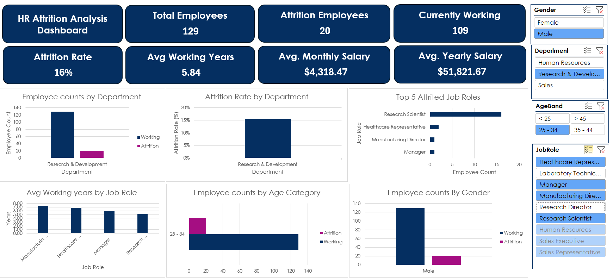

# HR Attrition Analysis Dashboard (Excel)

## 📊 Overview
This project is an **HR Attrition Analysis Dashboard** built entirely in **Excel** using **Power Query, Data Model, Measures (DAX), PivotTables, and PivotCharts**.  
It provides key insights into employee attrition, demographics, and workforce distribution.

The dataset used is the **HR Employee Attrition dataset (IBM HR Analytics)**, which contains employee details such as department, age, job role, salary, years at company, and attrition status.

---

## 🚀 Features
- **Data Cleaning & Transformation**  
  - Performed in Power Query (removed nulls, standardized columns, created age bands, etc.)  
  - Loaded into the **Excel Data Model**.

- **DAX Measures Created**
  - `TotalEmployees` → Total headcount  
  - `AttritionCount` → Number of employees who left  
  - `AttritionRate` → % of employees who left  
  - `AvgYearsAtCompany` → Average tenure  
  - `AvgMonthlyIncome` → Average monthly salary  
  - `AvgAnnualIncome` → Average yearly salary  
  - `PercentOvertime` → Share of employees working overtime  

- **Interactive Dashboard**
  - KPI Cards → Total Employees, Attrition Employees, Current Employees, Attrition Rate, Avg Tenure, Avg Salary  
  - Charts:  
    - Employee Count by Department  
    - Attrition Rate by Department  
    - Top 5 Attritted Job Roles  
    - Avg Working Years by Job Role  
    - Employee Count by Age Band  
    - Employee Count by Gender  
  - **Slicers for filtering** → Gender, Department, Age Band, Job Role  

---

## 📈 Final Dashboard
Here is a preview of the dashboard:

1.Main Dashboard

2.Gender Filtered Dashboard

3.Department Filtered Dashboard

4.Age Filtered Dashboard

5.JobRole Filtered Dashboard

6.All Filtered Filtered Dashboard

---

## 🛠️ Tools & Technologies
- **Excel** (Power Query, Data Model, PivotTables, PivotCharts, Slicers)
- **DAX Measures** inside Excel Data Model

---